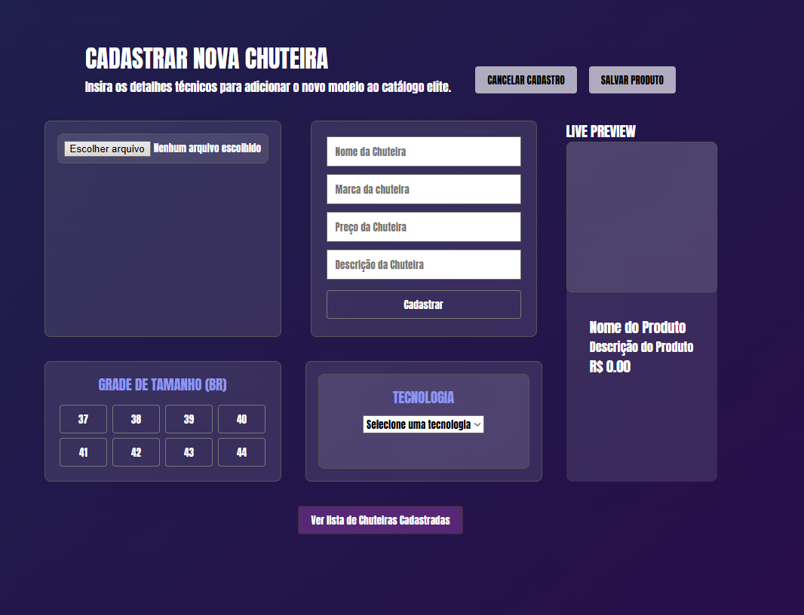
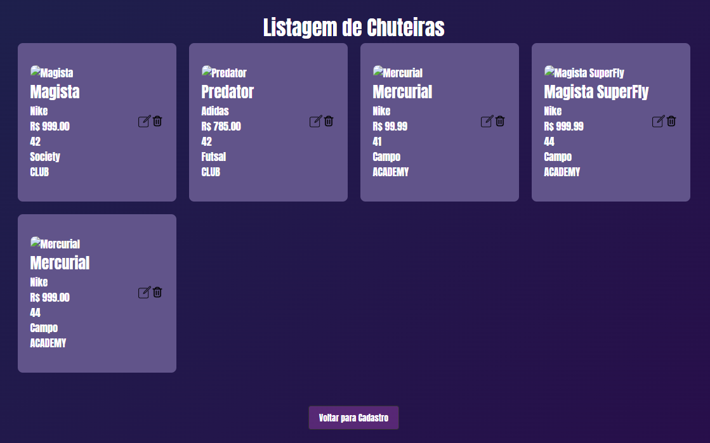
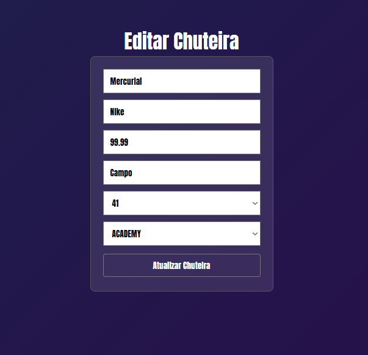

# Elite Boots Store 🛍️ 👟

## Sobre o Projeto 

Elite Boots Store é uma aplicação Full Stack desenvolvida para gerenciamento de chuteiras esportivas.

A plataforma permite cadastrar, visualizar, editar e remover produtos através de uma interface moderna e integrada a uma API REST.

O projeto foi desenvolvido com foco em praticar conceitos de desenvolvimento Full Stack, integração Front-End e Back-End, manipulação de banco de dados e arquitetura CRUD.

## Demonstração

### Tela de Cadastro

### Listagem de Produtos

### Tela de Edição

## Deploy
Frontend:
https://seu-site.vercel.app

Backend:
https://sua-api.onrender.com

## Funcionalidades

- Cadastro de chuteiras
- Listagem de produtos
- Atualização de produtos
- Exclusão de produtos
- Visualização em tempo real dos dados cadastrados
- Integração com banco de dados MongoDB
- API REST utilizando Express

## Tecnologias Utilizadas

### Frontend

- React
- Vite
- Axios
- React Router DOM
- Styled Components
- React Toastify

### Backend

- Node.js
- Express
- Prisma ORM

### Banco de Dados

- MongoDB

## Estrutura do Projeto

elite-boots-store
│
├── backend
│   ├── prisma
│   ├── server.js
│   └── package.json
│
├── frontend
│   ├── src
│   ├── public
│   └── package.json
│
└── README.md

---

# 7. Endpoints da API

## API

### Listar chuteiras

GET /chuteiras

### Buscar chuteira por ID

GET /chuteiras/:id

### Cadastrar chuteira

POST /chuteira-cadastrada

### Atualizar chuteira

PUT /chuteiras/:id

### Excluir chuteira

DELETE /chuteiras/:id

## Executando o Projeto

##Back End
cd backend

npm install

npm run dev

##Front End
cd frontend

npm install

npm run dev

## Aprendizados

Durante o desenvolvimento deste projeto foram aplicados conceitos como:

- CRUD completo
- Integração Front-End e Back-End
- Consumo de APIs REST
- Gerenciamento de estado com React Hooks
- Rotas com React Router DOM
- ORM Prisma
- Banco de dados MongoDB
- Componentização React
- Reutilização de código através de componentes

## Autor

Niccolas Peixoto

LinkedIn:
https://linkedin.com/in/niccolas-peixoto

GitHub:
https://github.com/niccolaspeixoto
